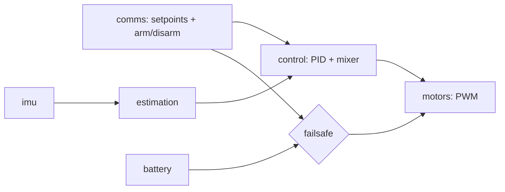

# Software Architecture

> **Draft.** This is a starting point for the "software flowchart" and "software architecture" roadmap items. Everything marked TBD needs a decision or a measurement first.

## Design Rules

- `main.cpp` only wires modules together. No logic lives there.
- Each module lives in `firmware/lib/<name>/` and talks to others through a small header-only interface.
- Pure-math modules (PID, motor mixer) have no hardware dependencies, so they can be unit-tested on a PC.
- Every module has a matching program in `firmware/bringup/` for testing it alone.

## Modules

| Module | Responsibility | Depends on |
|--------|----------------|------------|
| `imu` | BNO085 wrapper: returns orientation and angular rates | Adafruit BNO08x |
| `estimation` | Attitude estimate; sensor fusion beyond the BNO085's own if needed | `imu` |
| `control` | Attitude PID and motor mixer | none (pure math) |
| `motors` | PWM output, arm/disarm, failsafe cut-off | ESP32 PWM |
| `comms` | BLE / Wi-Fi input, produces setpoints and commands | ESP32 BLE, Wi-Fi |
| `battery` | ADC voltage reading, low-battery flag | ESP32 ADC |
| `config` | Pin map, PID gains, constants, limits | none |

## Data Flow

The failsafe path matters: loss of the control link or a low battery must be able to cut the motors regardless of what the controller is doing.

## Control Loop (proposed)

1. Read the attitude and angular rate from the IMU.
2. Compare against the setpoint from `comms` and compute roll, pitch and yaw corrections (PID).
3. Mix the corrections and throttle into four motor commands.
4. Clamp, apply arm state and failsafe, and write PWM.

Loop rate: **TBD**. Measure how fast the BNO085 can deliver data over your chosen bus before picking a rate.

## Tasks (FreeRTOS, tentative)

| Task | Purpose | Rate |
|------|---------|------|
| Control | IMU read, PID, mixer, PWM | TBD (highest priority) |
| Comms | Receive commands, later send telemetry | TBD |
| Housekeeping | Battery monitoring, status LED | TBD (low) |

## Open Questions

- ESP-IDF or Arduino-ESP32?
- IMU bus (I2C or SPI) and the resulting achievable loop rate
- Motor PWM frequency and resolution for the coreless motors
- What "armed" means and how a disarm is triggered
- Behaviour on link loss: cut motors immediately or ramp down?
- Motor numbering and rotation layout (which corner is which, CW/CCW), documented once the frame is built
